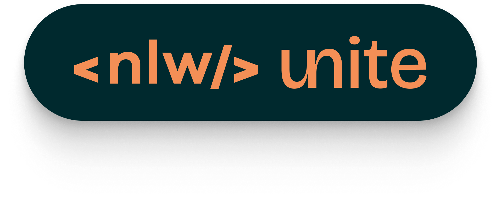

<h1 align="center"> 🚀👨🏼‍🚀 Projeto pass in </h1>
 

  

   
  Este é um projeto desenvolvido com o propósito de ser usado como cartão de visitas em meu perfil. 
   
  <a href="https://rocketforms.typeform.com/to/fPcSmBp9#referral_id=e8eb53b2-1777-4867-9b33-d468fc9d1422o">Assista a projetos semelhantes em formato de vídeo clicando aqui!</a>

 

  <a href="#-projeto" style="color: #FFF; ">Projeto</a>&nbsp;&nbsp;&nbsp;|&nbsp;&nbsp;&nbsp;
  <a href="#-linguagens-tecnologias--ferramentas" style="color: #FFF">Linguagens, Tecnologias & Ferramentas</a>&nbsp;&nbsp;&nbsp;|&nbsp;&nbsp;&nbsp;
  <a href="#-layout" style="color: #FFF;">Layout</a>&nbsp;&nbsp;&nbsp;

 

  

## 🧠 Linguagens, Tecnologias & Ferramentas

Este projeto foi desenvolvido com as seguintes linguagens, tecnologias e ferramentas:

 

## 💻 Projeto

  O  Pass in é o projeto do evento NLW Unite da Rocketseat!
  O projeto se trata de uma página na web, onde os participantes do evento realizam o cadastro e os dados dos participantes(nome e e-mail) aparecem um uma tabela onde é mostrado a data da incrição e do check-in.

  Esse é o projeto da trilha de HTML + CSS + JAVASCRIPT.
  Meu primeiro projeto de um evento da Next Level Week e foi sensacional.
  
  A trilha é principalmente pra quem está começando,mas a escolhi para revisar alguns conceitos e trabalhar com a biblioteca day.js... que serviu para fazer o ajustes na nosa lógica de programação em JavaScript, analisando, manipulando e formatando datas e horas de acordo com o tempo em que foram feitas as incrições e check-ins dos participantes.

[➡️😉Acesse o projeto finalizado online](https://pabloperdigao.github.io/nlw_unite_fullStack/)

## 🔖 Layout

Você pode visualizar o layout do projeto através  
[🔗 DESSE LINK](https://www.figma.com/file/aR4zKZo4jBtmhcDFa5fXNr/pass.in-(Community)?type=design&node-id=4003-2784&mode=design&t=xlADrHSdAlEa6jsQ-0)

❗ É necessário ter conta no [Figma](https://figma.com?target=_blank) para acessá-lo.

- [Veja outros projetos de UI aqui!](https://www.figma.com/@pabloperdigao)

## 
🎨👨🏼‍💻😎
<strong>Desenvolvido com estilo por Pablo Perdigão, desde o UI Design ao Code, do zero!</strong> 
 
[🤝🏼🌐 Siga-me & ajude na criação de uma rede cada vez mais interconectada!](https://www.instagram.com/perdigao.techjourney)
